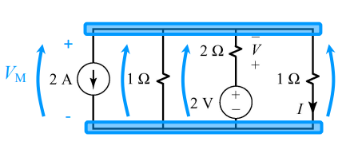

# Millman's theorem & basic equivalences #

## Millman's topology ##
 
A circuit that consists of all parallel connection of only the following type:

1. resistors
1. ideal current sources
1. series connections of and ideal voltage source and a resistor
	* **Note** resistors in series to the current source do not
	affect the Millman Voltage so we should not include it's
	conductance in our calculations

## Millman's theorem ##

$$V_m = \frac{[A] + [B]}{[C]}$$ 

Where:

$[A]$ = $\sum \pm G_kE_k$ for the branches with the voltage sources and
resistors in series (positive is the voltage is in the same direction as
the $V_m$

$[B] = \sum \pm A_k$ for the branches with current sources (positive if
the direction of the current is the same as the $V_m$

$[C] = \sum $ condunctace of all resistors

Millman derived his theorem using a KCL at one of the two common nodes
shared by the branches in a circuit of his topology type.

## Examples ##

# Source transformation #

Two elements are equivalen if they have the same characteristic equation.

Typically:
* A voltage source with a resistor in series converts to a current source with
  a resistor in parallel.
* And vice versa, a current source with a resistor in parallel converts to a voltage
  source with a resistor in series.
