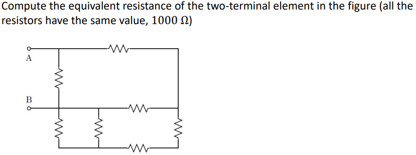
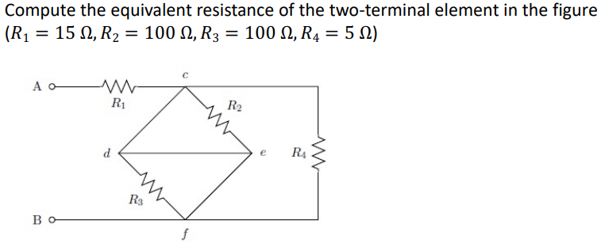
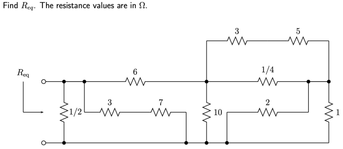
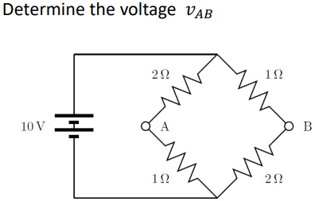
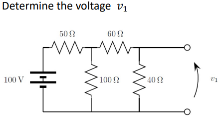
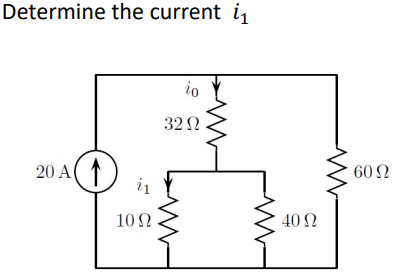
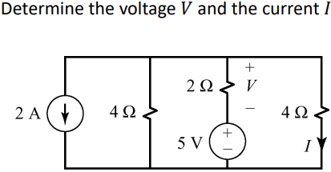

# Summary #

* Series resistors
* Parallel resistors
* Current divider
* Voltage divider
	* $I_k = I_s \cdot \frac{G_k}{\sum\limits_{n} G_n}$

# Ex 1 #

## Answer ##

**Ans: $\frac{12}{19}R$**

# Ex 2 #

## Answer ##

**Ans: $R_{eq}$ = $R_1$**

Because there is a short circuit from $c$ to $f$ passing by nodes $d$ & $e$

# Ex 3 #

## Answer ##

**Ans: $R_{eq}$ = $0.44 V$**

# Ex 4 #

## Working Out ##

Use voltage dividor to figure out the individual Voltages accross the
resistances and then add them up between B and A in the direction from B to A.

This would mean that you take the negative voltage of the bottom $2\Omega$
resistor and plus the positive voltage of the bottom $1\Omega$ resistor.

$\therefore -\frac{10V}{\frac{2}{3}} + \frac{10V}{\frac{1}{3}} = -\frac{20V}{3} + \frac{10V}{3}$

## Answer ##

**Ans: $v_{AB}$ = $-\frac{10}{3}V$**

# Ex 5 #

## Working Out ##

Use resistor simplifying to find out how much voltage makes it beyond the
$50\Omega$ resistor.
Then use potential dividor to figure out the voltage accross $v_1$

$\therefore R_{eq}$ of the $100\Omega, 60\Omega, 40\Omega$ resistors.
$R_{eq} = 50\Omega$ (Since the $60\Omega$ and the $40\Omega$ are in series so
they simplify to $100\Omega$. Then you have two $100\Omega$ resistors in
parallel which gives an $R_{eq}$ of $50\Omega$.

Using potential divider of the two $50\Omega$ resistors you get that $50V$ go accross the $R_{eq}$ circuit.

Using potential divider again (with the $60\Omega$ and $40\Omega$ resistors) you get that $20V$ go accross the $40\Omega$ resistor.

$\therefore v_1 = 20V$

## Answer ##

**Ans: $v_1$ = $20 V$**

# Ex 6 #

## Working Out ##

## Answer ##

**Ans: $i_1$ = $9.6 A$**

# Ex 7 #

## Working Out ##

## Answer ##

**Ans: V = $-\frac{9}{2}V$ and $\frac{1}{8}A$**

# Electrons are smart! #
