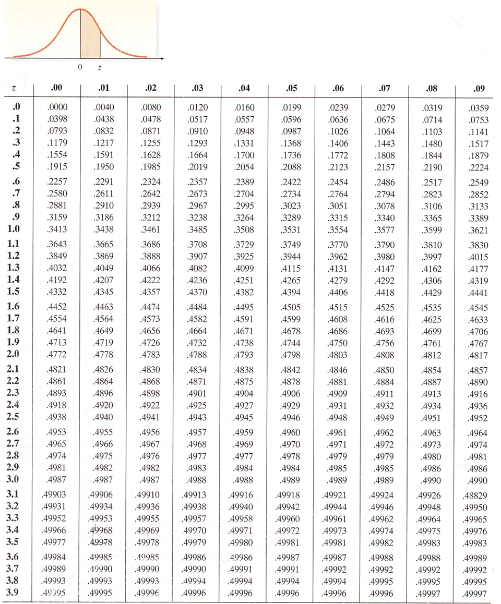

# Normal Distribution

<strong>DEFINITION:</strong>

$X \sim N(\mu, \sigma)$ represents a normal distribution, where:
* $\mu =$ mean
* $\sigma =$ standard deviation

$P(X\ge x) = \Phi(z)$

$$\Phi(z) = \dfrac{1}{\sqrt{2\pi}} \int^z_{\infty} e^{\frac{-t^2}{2}} dt$$

# Calculating z

<strong>DEFINITION:</strong>

$z = \dfrac{x - \mu}{\sigma} \quad$ where:
* $x =$ individual value
* $\mu =$ mean
* $\sigma =$ standard deviation

# Normal Distribution Table

Used with the z value that was shown how to be calculated above.

# The Empiricals

1. **68%** of the data lies between **$\pm 1\sigma$** of $\mu$

1. **95%** of the data lies between **$\pm 2\sigma$** of $\mu$

1. **99.7%** of the data lies between **$\pm 3\sigma$** of $\mu$

# Hipothesis testing
